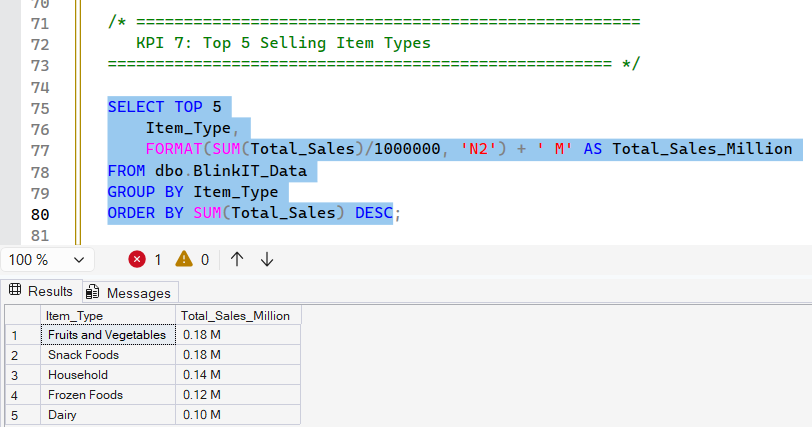
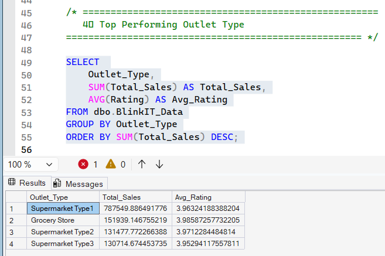
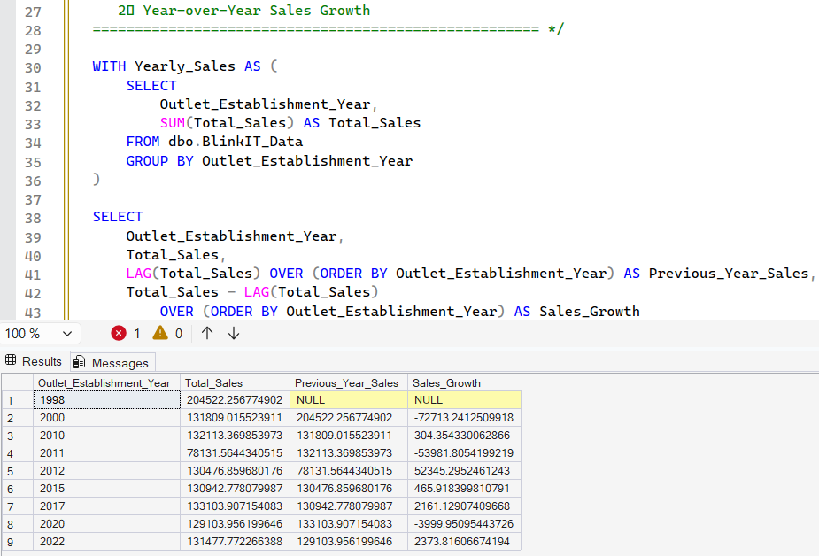

# 🛒 Blinkit SQL Data Analysis Project

## 📌 Project Overview
This project focuses on performing end-to-end SQL data analysis on Blinkit retail sales data.  
The objective is to clean raw data, generate KPIs, perform business analysis, and derive advanced insights using SQL.

The project demonstrates strong understanding of:
- Data Cleaning
- KPI Reporting
- Business Analysis
- Advanced SQL (CTEs, Window Functions, Ranking, Aggregations)

---

## 🛠 Tools Used
- SQL Server (T-SQL)
- SSMS
- Git & GitHub

---

## 📂 Project Structure

```
Blinkit-SQL-Data-Analysis
│
├── 01_data_cleaning.sql
├── 02_kpi_analysis.sql
├── 03_business_analysis.sql
├── 04_advanced_analysis.sql
└── README.md
```

---

## 🔹 01 - Data Cleaning
- Standardized `Item_Fat_Content` values
- Handled inconsistent text entries
- Validated data integrity
- Ensured correct database selection using `USE` statement

---

## 🔹 02 - KPI Analysis
Generated core performance metrics:
- Total Sales
- Total Items Sold
- Average Sales
- Average Rating
- Sales by Fat Content
- Sales by Outlet Type
- Top 5 Selling Item Types

---

## 🔹 03 - Business Analysis
Answered key business questions:
- Sales trend by outlet establishment year
- Revenue contribution by outlet size
- Rating impact on sales
- Top performing outlet types
- Sales contribution percentage analysis

---

## 🔹 04 - Advanced Analysis
Implemented advanced SQL techniques:
- CTE (Common Table Expressions)
- RANK() function
- LAG() for Year-over-Year growth
- Running totals using window functions
- Percentage contribution using OVER()

---

## 📊 Key Insights
- Certain outlet types contribute significantly higher revenue.
- Sales trend varies by establishment year.
- Higher-rated items generally show stronger revenue performance.
- A few item categories dominate overall sales contribution.

---

## 🚀 Skills Demonstrated
- Data Cleaning & Transformation
- Business KPI Development
- SQL Aggregations & Grouping
- Window Functions
- Analytical Thinking
- Project Structuring for GitHub Portfolio

---

## 📸 Project Screenshots

### 🔹 KPI Analysis


### 🔹 Business Analysis


### 🔹 Advanced SQL Analysis



---

## 👤 Author
Manikantan  
SQL | Power BI | Python | Business Analytics
